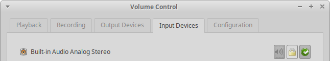

## Upgrading from 18.04

For 32 bit installations this is [disabled](https://wiki.ubuntu.com/CosmicCuttlefish/ReleaseNotes#Upgrades_on_i386) and currently out of our control.

## Installer Issues

**It must be noted that it is close to impossible for our small team of testers to be in a position to work through all the varying parameters available during installation. We do however aim to test all the possible methods of installation (including for OEM and using encryption) available either on a virtual machine or on hardware (where hardware has been used during testing then Xubuntu QA will where possible make that known on the iso testing tracker). Further installation testing information can be on the Ubuntu installation release note(s) listed below**

*  No restart after installation ([1723760](https://bugs.launchpad.net/ubuntu/+source/casper/+bug/1723760))

## General Issues

* **GNOME Software crashes on 32-bit architectures** ([1798236](https://bugs.launchpad.net/ubuntu/+source/gnome-software/+bug/1798236))
  * This issue should be resolved after installing and running updates.
* Network indicators
  * Currently at times the panel could show 2 network icons, this appears to be a race condition which we have not been able to rectify in time for release.
* Panel
  * Applications Menu plugin clips panel icon ([1756608](https://bugs.launchpad.net/ubuntu/+source/xfce4-panel/+bug/1756608))
  * Launch and Directory Menu items icons are too small ([1756612](https://bugs.launchpad.net/ubuntu/+source/xfce4-panel/+bug/1756612))
  * Window buttons are not clickable at very top of screen (0px area) ([1795135](https://bugs.launchpad.net/ubuntu/+source/greybird-gtk-theme/+bug/1795135))
* Parole Media Player
  * Play button inactive ([1705243](https://bugs.launchpad.net/parole/+bug/1705243))
  * Player crashes when MPRIS2 plugin is disabled ([1698540](https://bugs.launchpad.net/ubuntu/+source/parole/+bug/1698540))
* Ristretto: Thumbnail sidebar shows error icons instead of thumbnails for some images ([1756191](https://bugs.launchpad.net/ubuntu/+source/ristretto/+bug/1756191))
* Settings Manager: Mouse fails to scroll apps in settings manager (GTK+ 3 regression) ([1653448](https://bugs.launchpad.net/ubuntu/+source/xfce4-settings/+bug/1653448))

### Ubuntu Generic Release Note

The main Ubuntu release [note](https://wiki.ubuntu.com/CosmicCuttlefish/ReleaseNotes) covers both many of the other packages we carry and more generic issues.

## Major Updates

### Appearance

#### Cosmic Wallpaper
Our beautiful new wallpaper features a gentle purple tone and greatly complements our GTK and icon themes. Past wallpapers are available in the [xubuntu-wallpapers](https://launchpad.net/ubuntu/cosmic/+package/xubuntu-wallpapers) package.

#### elementary Xfce Icon Theme 0.13
The latest version of [our icon theme](https://github.com/shimmerproject/elementary-xfce) includes the manila folder icons as seen in the [upstream elementary icon theme](https://github.com/elementary/icons). Additionally, our icon theme is now optimized with optipng, meaning a smaller install size and potentially improved load times.

#### Greybird 3.22.9
The latest [Greybird](https://github.com/shimmerproject/Greybird) release improves the look and feel of our window manager, alt-tab dialog, Chromium, and even pavucontrol! The notebook styles look significantly better and consistent with our other applications.

### Xfce

#### Applications
* [Catfish 1.4.6](https://bluesabre.org/2018/07/15/catfish-1-4-6-released-now-an-xfce-project/)
* [Mousepad 0.4.1](https://mail.xfce.org/pipermail/xfce-announce/2018-June/000609.html)
* [Ristretto 0.8.3](https://mail.xfce.org/pipermail/xfce-announce/2018-June/000623.html)
* [Thunar 1.8.1](https://mail.xfce.org/pipermail/xfce-announce/2018-June/000614.html) *(New GTK+ 3 release!)*
* [Xfce Desktop 4.13.2](https://mail.xfce.org/pipermail/xfce-announce/2018-June/000616.html) *(New GTK+ 3 release!)*
* [Xfce Dictionary 0.8.1](https://mail.xfce.org/pipermail/xfce-announce/2018-June/000610.html)
* [Xfce Panel 4.13.3](https://mail.xfce.org/pipermail/xfce-announce/2018-May/000605.html) *(New GTK+ 3 release!)*
* [Xfce Screenshooter 1.9.3](https://mail.xfce.org/pipermail/xfce-announce/2018-August/000632.html) *(New GTK+ 3 release!)*
* [Xfce Settings 4.13.4](https://bluesabre.org/2018/06/20/xfce-settings-4-12-4-and-4-13-4-released/) *(New GTK+ 3 release!)*
* [Xfce Task Manager 1.2.1](https://mail.xfce.org/pipermail/xfce-announce/2018-June/000612.html)
* [Xfce Terminal 0.8.7.4](https://mail.xfce.org/pipermail/xfce-announce/2018-May/000606.html)
* [Xfce Window Manager 4.12.5](https://mail.xfce.org/pipermail/xfce-announce/2018-July/000629.html)

#### Libraries
* [Exo 0.12.2](https://bluesabre.org/2018/06/20/exo-0-12-1-and-0-12-2-released/)
* [libxfce4util 4.13.2](https://mail.xfce.org/pipermail/xfce-announce/2018-June/000615.html)
* [Tumbler 0.2.3](https://mail.xfce.org/pipermail/xfce-announce/2018-September/000635.html)
* [Xfconf 4.13.5](https://mail.xfce.org/pipermail/xfce-announce/2018-June/000619.html)

#### Panel Plugins
* [Xfce Verve Plugin 2.0.0](https://mail.xfce.org/pipermail/xfce-announce/2018-April/000601.html) *(New GTK+ 3 release!)*
* [Xfce Whisker Menu Plugin 2.2.1](https://mail.xfce.org/pipermail/xfce-announce/2018-July/000624.html)

#### Thunar Plugins
* [Thunar Archive Plugin 0.4.0](https://mail.xfce.org/pipermail/xfce-announce/2017-December/000566.html)
* [Thunar Media Tags Plugin 0.3.0](https://mail.xfce.org/pipermail/xfce-announce/2018-February/000577.html)

## Changelogs

### Xubuntu/Other Packages

* atril ([changelog](https://launchpad.net/ubuntu/cosmic/+source/atril/+changelog))
* blueman ([changelog](https://launchpad.net/ubuntu/cosmic/+source/blueman/+changelog))
* elementary-xfce ([changelog](https://launchpad.net/ubuntu/cosmic/+source/elementary-xfce/+changelog))
* engrampa ([changelog](https://launchpad.net/ubuntu/cosmic/+source/engrampa/+changelog))
* gtk2-engines-xfce ([changelog](https://launchpad.net/ubuntu/cosmic/+source/gtk2-engines-xfce/+changelog))
* lightdm-gtk-greeter ([changelog](https://launchpad.net/ubuntu/cosmic/+source/lightdm-gtk-greeter/+changelog))
* lightdm-gtk-greeter-settings ([changelog](https://launchpad.net/ubuntu/cosmic/+source/lightdm-gtk-greeter-settings/+changelog))
* mate-calc ([changelog](https://launchpad.net/ubuntu/cosmic/+source/mate-calc/+changelog))
* menulibre ([changelog](https://launchpad.net/ubuntu/cosmic/+source/menulibre/+changelog))
* mugshot ([changelog](https://launchpad.net/ubuntu/cosmic/+source/mugshot/+changelog))
* pavucontrol ([changelog](https://launchpad.net/ubuntu/cosmic/+source/pavucontrol/+changelog))
* sgt-launcher ([changelog](https://launchpad.net/ubuntu/cosmic/+source/sgt-launcher/+changelog))
* shimmer-themes ([changelog](https://launchpad.net/ubuntu/cosmic/+source/shimmer-themes/+changelog))
* xfpanel-switch  ([changelog](https://launchpad.net/ubuntu/cosmic/+source/xfpanel-switch/+changelog))
* xubuntu-artwork ([changelog](https://launchpad.net/ubuntu/cosmic/+source/xubuntu-artwork/+changelog))
* xubuntu-core ([changelog](https://launchpad.net/ubuntu/cosmic/+source/xubuntu-meta/+changelog))
* xubuntu-default-settings ([changelog](https://launchpad.net/ubuntu/cosmic/+source/xubuntu-default-settings/+changelog))
* xubuntu-desktop ([changelog](https://launchpad.net/ubuntu/cosmic/+source/xubuntu-meta/+changelog))
* xubuntu-docs ([changelog](https://launchpad.net/ubuntu/cosmic/+source/xubuntu-docs/+changelog))
* xubuntu-meta ([changelog](https://launchpad.net/ubuntu/cosmic/+source/xubuntu-meta/+changelog))
* xubuntu-wallpapers ([changelog](https://launchpad.net/ubuntu/cosmic/+source/xubuntu-artwork/+changelog))

### Xfce Core

* exo ([changelog](https://launchpad.net/ubuntu/cosmic/+source/exo/+changelog))
* libxfce4ui ([changelog](https://launchpad.net/ubuntu/cosmic/+source/libxfce4ui/+changelog))
* libxfce4util ([changelog](https://launchpad.net/ubuntu/cosmic/+source/libxfce4util/+changelog))
* thunar ([changelog](https://launchpad.net/ubuntu/cosmic/+source/thunar/+changelog))
* thunar-volman ([changelog](https://launchpad.net/ubuntu/cosmic/+source/thunar-volman/+changelog))
* tumbler ([changelog](https://launchpad.net/ubuntu/cosmic/+source/tumbler/+changelog))
* xfce4-appfinder ([changelog](https://launchpad.net/ubuntu/cosmic/+source/xfce4-appfinder/+changelog))
* xfce4-panel ([changelog](https://launchpad.net/ubuntu/cosmic/+source/xfce4-panel/+changelog))
* xfce4-power-manager ([changelog](https://launchpad.net/ubuntu/cosmic/+source/xfce4-power-manager/+changelog))
* xfce4-session ([changelog](https://launchpad.net/ubuntu/cosmic/+source/xfce4-session/+changelog))
* xfce4-settings ([changelog](https://launchpad.net/ubuntu/cosmic/+source/xfce4-settings/+changelog))
* xfconf ([changelog](https://launchpad.net/ubuntu/cosmic/+source/xfconf/+changelog))
* xfdesktop4 ([changelog](https://launchpad.net/ubuntu/cosmic/+source/xfdesktop4/+changelog))
* xfwm4 ([changelog](https://launchpad.net/ubuntu/cosmic/+source/xfwm4/+changelog))

### Xfce Applications

* catfish ([changelog](https://launchpad.net/ubuntu/cosmic/+source/catfish/+changelog))
* mousepad ([changelog](https://launchpad.net/ubuntu/cosmic/+source/mousepad/+changelog))
* orage ([changelog](https://launchpad.net/ubuntu/cosmic/+source/orage/+changelog))
* parole ([changelog](https://launchpad.net/ubuntu/cosmic/+source/parole/+changelog))
* ristretto ([changelog](https://launchpad.net/ubuntu/cosmic/+source/ristretto/+changelog))
* xfburn ([changelog](https://launchpad.net/ubuntu/cosmic/+source/xfburn/+changelog))
* xfce4-notifyd ([changelog](https://launchpad.net/ubuntu/cosmic/+source/xfce4-notifyd/+changelog))
* xfce4-screenshooter ([changelog](https://launchpad.net/ubuntu/cosmic/+source/xfce4-screenshooter/+changelog))
* xfce4-taskmanager ([changelog](https://launchpad.net/ubuntu/cosmic/+source/xfce4-taskmanager/+changelog))
* xfce4-terminal ([changelog](https://launchpad.net/ubuntu/cosmic/+source/xfce4-terminal/+changelog))

### Xfce Panel Plugins

* xfce4-cpugraph-plugin ([changelog](https://launchpad.net/ubuntu/cosmic/+source/xfce4-cpugraph-plugin/+changelog))
* xfce4-dict ([changelog](https://launchpad.net/ubuntu/cosmic/+source/xfce4-dict/+changelog))
* xfce4-indicator-plugin ([changelog](https://launchpad.net/ubuntu/cosmic/+source/xfce4-indicator-plugin/+changelog))
* xfce4-mailwatch-plugin ([changelog](https://launchpad.net/ubuntu/cosmic/+source/xfce4-mailwatch-plugin/+changelog))
* xfce4-netload-plugin ([changelog](https://launchpad.net/ubuntu/cosmic/+source/xfce4-netload-plugin/+changelog))
* xfce4-notes-plugin ([changelog](https://launchpad.net/ubuntu/cosmic/+source/xfce4-notes-plugin/+changelog)
* xfce4-places-plugin ([changelog](https://launchpad.net/ubuntu/cosmic/+source/xfce4-places-plugin/+changelog))
* xfce4-pulseaudio-plugin ([changelog](https://launchpad.net/ubuntu/cosmic/+source/xfce4-pulseaudio-plugin/+changelog))
* xfce4-quicklauncher-plugin ([changelog](https://launchpad.net/ubuntu/cosmic/+source/xfce4-quicklauncher-plugin/+changelog))
* xfce4-statusnotifier-plugin ([changelog](https://launchpad.net/ubuntu/cosmic/+source/xfce4-statusnotifier-plugin/+changelog))
* xfce4-systemload-plugin ([changelog](https://launchpad.net/ubuntu/cosmic/+source/xfce4-systemload-plugin/+changelog))
* xfce4-verve-plugin ([changelog](https://launchpad.net/ubuntu/cosmic/+source/xfce4-verve-plugin/+changelog))
* xfce4-weather-plugin ([changelog](https://launchpad.net/ubuntu/cosmic/+source/xfce4-weather-plugin/+changelog))
* xfce4-whiskermenu-plugin ([changelog](https://launchpad.net/ubuntu/cosmic/+source/xfce4-whiskermenu-plugin/+changelog))
* xfce4-xkb-plugin ([changelog](https://launchpad.net/ubuntu/cosmic/+source/xfce4-xkb-plugin/+changelog))

### Thunar Plugins

* thunar-archive-plugin ([changelog](https://launchpad.net/ubuntu/cosmic/+source/thunar-archive-plugin/+changelog))
* thunar-media-tags-plugin ([changelog](https://launchpad.net/ubuntu/cosmic/+source/thunar-media-tags-plugin/+changelog))
