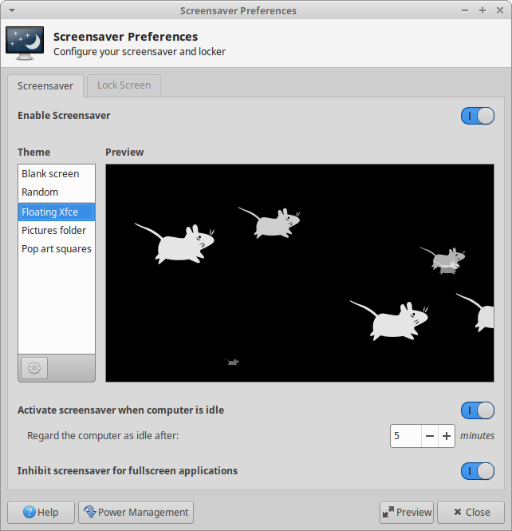
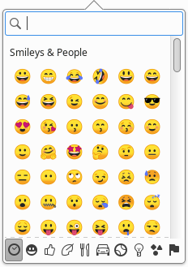

## Known Issues

### Installer Issues

* System doesn't boot after installation - Legacy mode / 2 disks ([1847898](https://bugs.launchpad.net/ubuntu/+source/ubiquity/+bug/1847898))

### General Issues

* GNOME Font Viewer: Crashes in the live environment ([1845362](https://bugs.launchpad.net/ubuntu/+source/gnome-font-viewer/+bug/1845362))
* Ubiquity: Chooses which drive to install to with no user input ([964331](https://bugs.launchpad.net/ubuntu/+source/grub-installer/+bug/964331))
* Xfce Pulseaudio Plugin: Multiple notifications displayed if multiple Pulseaudio plugins added to panel ([1769775](https://bugs.launchpad.net/ubuntu/+source/xfce4-pulseaudio-plugin/+bug/1769775))
* Xfce Task Manager: Tooltips become unresponsive ([1740578](https://bugs.launchpad.net/ubuntu/+source/xfce4-taskmanager/+bug/1740578), fix committed upstream)

#### Ubuntu Generic Release Note

The main Ubuntu release [note](https://wiki.ubuntu.com/EoanErmine/ReleaseNotes) covers both many of the other packages we carry and more generic issues.

## Major Updates

### Xfce 4.14
Released in August 2019, Xfce 4.14 is a modern desktop built on top of the latest libraries. From the release announcement:

> In this 4.14 cycle the main goal was to port all core components to Gtk3 (over Gtk2) and GDBus (over D-Bus GLib). Most components also received GObject Introspection support. Along the way we ended up polishing our user experience, introducing quite a few new features and improvements and fixing a boatload of bugs.

[Release Announcement](https://xfce.org/about/news/?post=1565568000) /
[Feature Tour](https://xfce.org/about/tour) /
[Changelog](https://www.xfce.org/download/changelogs/4.14)

### Light Locker Replaced by Xfce Screensaver

Light Locker, our lockscreen since Xenial, has now been replaced with Xfce Screensaver. The new screensaver application is tightly integrated with Xfce and includes a number of features to significantly improve the lock experience in Xubuntu.

* Improved support for suspend and hibernate, including laptops
* Integration with Xfce Power Manager
* Support for X11 Screensaver signals
* DPMS support for better monitor power management
* Support for all Xscreensaver screensavers

### Keyboard Shortcuts

Xubuntu 19.10 includes two new keyboard shortcuts to make transitioning from other desktop environments easier.

* **Super + L** will now lock your session.
* **Super + D** will now show and hide your desktop.

### ZFS on root

* Support for ZFS as the root filesystem is added as an experimental feature in 19.10
* When installing, select "EXPERIMENTAL: Erase disk and use ZFS" to create the ZFS file system and partitioning layout automatically
    * *This feature is unavailable with manual partitioning options*
* You can read more details on Didrock's blog [here](https://didrocks.fr/2019/08/06/ubuntu-zfs-support-in-19.10-introduction/) and [here](https://didrocks.fr/2019/10/11/ubuntu-zfs-support-in-19.10-zfs-on-root/)

## Other Updates

### Color Emoji

During this development cycle, the team voted on whether to bring color emoji to Xubuntu. We didn't get quite enough votes to come to a decision, but if you're interested in having color emoji, it's easy to add or remove!

**Installing color emoji**\\
''sudo apt install fonts-noto-color-emoji''

**Restoring monochrome emoji**\\
''sudo apt remove fonts-noto-color-emoji''

## Changelogs

### Xubuntu/Other Packages

* apturl ([changelog](https://launchpad.net/ubuntu/eoan/+source/apturl/+changelog))
* atril ([changelog](https://launchpad.net/ubuntu/eoan/+source/atril/+changelog))
* blueman ([changelog](https://launchpad.net/ubuntu/eoan/+source/blueman/+changelog))
* elementary-xfce ([changelog](https://launchpad.net/ubuntu/eoan/+source/elementary-xfce/+changelog))
* engrampa ([changelog](https://launchpad.net/ubuntu/eoan/+source/engrampa/+changelog))
* gimp ([changelog](https://launchpad.net/ubuntu/eoan/+source/gimp/+changelog))
* gtk2-engines-xfce ([changelog](https://launchpad.net/ubuntu/eoan/+source/gtk2-engines-xfce/+changelog))
* lightdm-gtk-greeter ([changelog](https://launchpad.net/ubuntu/eoan/+source/lightdm-gtk-greeter/+changelog))
* lightdm-gtk-greeter-settings ([changelog](https://launchpad.net/ubuntu/eoan/+source/lightdm-gtk-greeter-settings/+changelog))
* mate-calc ([changelog](https://launchpad.net/ubuntu/eoan/+source/mate-calc/+changelog))
* menulibre ([changelog](https://launchpad.net/ubuntu/eoan/+source/menulibre/+changelog))
* mugshot ([changelog](https://launchpad.net/ubuntu/eoan/+source/mugshot/+changelog))
* pavucontrol ([changelog](https://launchpad.net/ubuntu/eoan/+source/pavucontrol/+changelog))
* sgt-launcher ([changelog](https://launchpad.net/ubuntu/eoan/+source/sgt-launcher/+changelog))
* shimmer-themes ([changelog](https://launchpad.net/ubuntu/eoan/+source/shimmer-themes/+changelog))
* xfpanel-switch  ([changelog](https://launchpad.net/ubuntu/eoan/+source/xfpanel-switch/+changelog))
* xubuntu-artwork ([changelog](https://launchpad.net/ubuntu/eoan/+source/xubuntu-artwork/+changelog))
* xubuntu-core ([changelog](https://launchpad.net/ubuntu/eoan/+source/xubuntu-meta/+changelog))
* xubuntu-default-settings ([changelog](https://launchpad.net/ubuntu/eoan/+source/xubuntu-default-settings/+changelog))
* xubuntu-desktop ([changelog](https://launchpad.net/ubuntu/eoan/+source/xubuntu-meta/+changelog))
* xubuntu-docs ([changelog](https://launchpad.net/ubuntu/eoan/+source/xubuntu-docs/+changelog))
* xubuntu-meta ([changelog](https://launchpad.net/ubuntu/eoan/+source/xubuntu-meta/+changelog))
* xubuntu-wallpapers ([changelog](https://launchpad.net/ubuntu/eoan/+source/xubuntu-artwork/+changelog))

### Xfce Core

* exo ([changelog](https://launchpad.net/ubuntu/eoan/+source/exo/+changelog))
* libxfce4ui ([changelog](https://launchpad.net/ubuntu/eoan/+source/libxfce4ui/+changelog))
* libxfce4util ([changelog](https://launchpad.net/ubuntu/eoan/+source/libxfce4util/+changelog))
* thunar ([changelog](https://launchpad.net/ubuntu/eoan/+source/thunar/+changelog))
* thunar-volman ([changelog](https://launchpad.net/ubuntu/eoan/+source/thunar-volman/+changelog))
* tumbler ([changelog](https://launchpad.net/ubuntu/eoan/+source/tumbler/+changelog))
* xfce4-appfinder ([changelog](https://launchpad.net/ubuntu/eoan/+source/xfce4-appfinder/+changelog))
* xfce4-panel ([changelog](https://launchpad.net/ubuntu/eoan/+source/xfce4-panel/+changelog))
* xfce4-power-manager ([changelog](https://launchpad.net/ubuntu/eoan/+source/xfce4-power-manager/+changelog))
* xfce4-session ([changelog](https://launchpad.net/ubuntu/eoan/+source/xfce4-session/+changelog))
* xfce4-settings ([changelog](https://launchpad.net/ubuntu/eoan/+source/xfce4-settings/+changelog))
* xfconf ([changelog](https://launchpad.net/ubuntu/eoan/+source/xfconf/+changelog))
* xfdesktop4 ([changelog](https://launchpad.net/ubuntu/eoan/+source/xfdesktop4/+changelog))
* xfwm4 ([changelog](https://launchpad.net/ubuntu/eoan/+source/xfwm4/+changelog))

### Xfce Applications

* catfish ([changelog](https://launchpad.net/ubuntu/eoan/+source/catfish/+changelog))
* mousepad ([changelog](https://launchpad.net/ubuntu/eoan/+source/mousepad/+changelog))
* parole ([changelog](https://launchpad.net/ubuntu/eoan/+source/parole/+changelog))
* ristretto ([changelog](https://launchpad.net/ubuntu/eoan/+source/ristretto/+changelog))
* xfburn ([changelog](https://launchpad.net/ubuntu/eoan/+source/xfburn/+changelog))
* xfce4-notifyd ([changelog](https://launchpad.net/ubuntu/eoan/+source/xfce4-notifyd/+changelog))
* xfce4-screenshooter ([changelog](https://launchpad.net/ubuntu/eoan/+source/xfce4-screenshooter/+changelog))
* xfce4-taskmanager ([changelog](https://launchpad.net/ubuntu/eoan/+source/xfce4-taskmanager/+changelog))
* xfce4-terminal ([changelog](https://launchpad.net/ubuntu/eoan/+source/xfce4-terminal/+changelog))

### Xfce Panel Plugins

* xfce4-cpugraph-plugin ([changelog](https://launchpad.net/ubuntu/eoan/+source/xfce4-cpugraph-plugin/+changelog))
* xfce4-dict ([changelog](https://launchpad.net/ubuntu/eoan/+source/xfce4-dict/+changelog))
* xfce4-indicator-plugin ([changelog](https://launchpad.net/ubuntu/eoan/+source/xfce4-indicator-plugin/+changelog))
* xfce4-mailwatch-plugin ([changelog](https://launchpad.net/ubuntu/eoan/+source/xfce4-mailwatch-plugin/+changelog))
* xfce4-netload-plugin ([changelog](https://launchpad.net/ubuntu/eoan/+source/xfce4-netload-plugin/+changelog))
* xfce4-notes-plugin ([changelog](https://launchpad.net/ubuntu/eoan/+source/xfce4-notes-plugin/+changelog)
* xfce4-places-plugin ([changelog](https://launchpad.net/ubuntu/eoan/+source/xfce4-places-plugin/+changelog))
* xfce4-pulseaudio-plugin ([changelog](https://launchpad.net/ubuntu/eoan/+source/xfce4-pulseaudio-plugin/+changelog))
* xfce4-quicklauncher-plugin ([changelog](https://launchpad.net/ubuntu/eoan/+source/xfce4-quicklauncher-plugin/+changelog))
* xfce4-statusnotifier-plugin ([changelog](https://launchpad.net/ubuntu/eoan/+source/xfce4-statusnotifier-plugin/+changelog))
* xfce4-systemload-plugin ([changelog](https://launchpad.net/ubuntu/eoan/+source/xfce4-systemload-plugin/+changelog))
* xfce4-verve-plugin ([changelog](https://launchpad.net/ubuntu/eoan/+source/xfce4-verve-plugin/+changelog))
* xfce4-weather-plugin ([changelog](https://launchpad.net/ubuntu/eoan/+source/xfce4-weather-plugin/+changelog))
* xfce4-whiskermenu-plugin ([changelog](https://launchpad.net/ubuntu/eoan/+source/xfce4-whiskermenu-plugin/+changelog))
* xfce4-xkb-plugin ([changelog](https://launchpad.net/ubuntu/eoan/+source/xfce4-xkb-plugin/+changelog))

### Thunar Plugins

* thunar-archive-plugin ([changelog](https://launchpad.net/ubuntu/eoan/+source/thunar-archive-plugin/+changelog))
* thunar-media-tags-plugin ([changelog](https://launchpad.net/ubuntu/eoan/+source/thunar-media-tags-plugin/+changelog))
