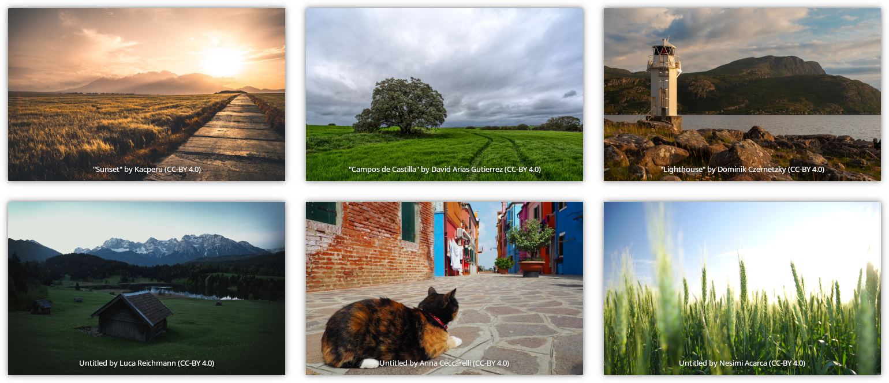
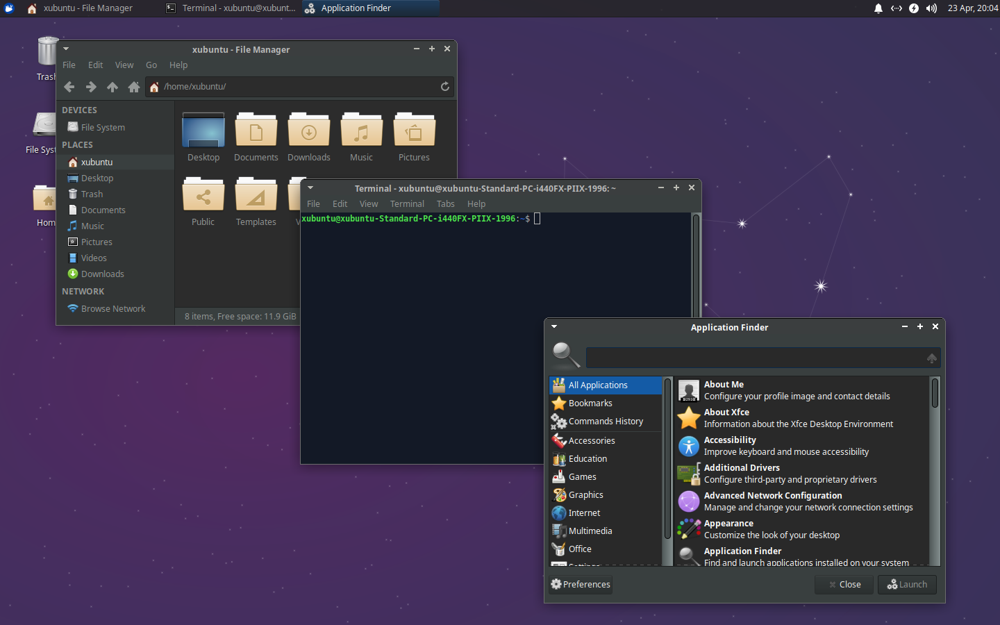
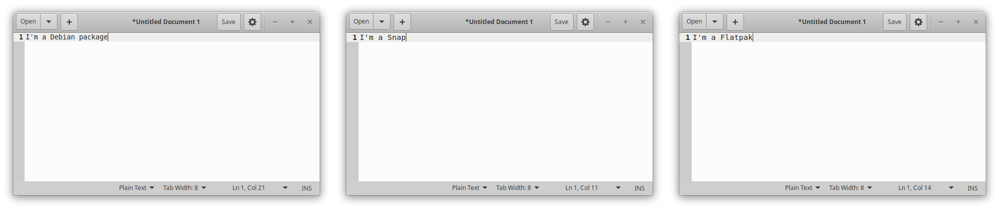

**Welcome to the Xubuntu 20.04 "Focal Fossa" release notes!**

Xubuntu 20.04 was released on Thursday, April 23, 2020 and will be supported for three years until Saturday, April 29, 2023. For general information and the latest updates for Xubuntu 20.04, check out the [release page](https://xubuntu.org/release/20-04) on xubuntu.org.

* [Known Issues](#known_issues)
* [Ubuntu Common Release Notes](#ubuntu_common_release_notes)
* [Screenshots](#screenshots)
* [Major Updates](#major_updates)
* [Removals](#removals)
* [Updates](#updates)
* [Changelogs](#changelogs)

## Known Issues

### Installer Issues

* System doesn't boot after installation - Legacy mode / 2 disks ([1847898](https://bugs.launchpad.net/ubuntu/+source/ubiquity/+bug/1847898))
* grub-installer chooses which drive to install to with no user input ([964331](https://bugs.launchpad.net/ubuntu/+source/grub-installer/+bug/964331))

### Graphical Issues

* AMD Graphics: Block staircase display with side-by-side monitors of different pixel widths ([1873895](https://bugs.launchpad.net/ubuntu/+source/xserver-xorg-video-amdgpu/+bug/1873895), [Fixed upstream](https://gitlab.freedesktop.org/daenzer/xf86-video-amdgpu/-/commit/0732f81a2c67354ddfa7a495bee6b0997c6ef244), SRU expected for 20.04.1)
* VNC (tightvncserver): Window decorations are not displayed ([1860921](https://bugs.launchpad.net/ubuntu/+source/xfwm4/+bug/1860921), Fixed upstream, SRU expected for 20.04.1)

### General Issues

* GNOME Font Viewer: Crashes in the live environment ([1845362](https://bugs.launchpad.net/ubuntu/+source/gnome-font-viewer/+bug/1845362))
* Xfce Pulseaudio Plugin: Multiple notifications displayed if multiple Pulseaudio plugins added to panel ([1769775](https://bugs.launchpad.net/ubuntu/+source/xfce4-pulseaudio-plugin/+bug/1769775))
* Xfce Screensaver: Password required twice when switching users ([1874178](https://bugs.launchpad.net/ubuntu/+source/lightdm/+bug/1874178))
* Xfce Settings Daemon: Sometimes does not run after logging in, resulting in appearance and configuration issues ([1870641](https://bugs.launchpad.net/ubuntu/+source/xfce4-settings/+bug/1870641))

## Ubuntu Common Release Notes

The main Ubuntu [Release Notes](https://wiki.ubuntu.com/FocalFossa/ReleaseNotes) covers both many of the other packages we carry and more issues common to every Ubuntu flavor.

## Screenshots

* [Installation](https://bluesabre.org/2020/04/12/xubuntu-20-04-in-screenshots-the-installer/) (bluesabre.org)
* [Desktop Applications](https://bluesabre.org/2020/04/17/xubuntu-20-04-in-screenshots-desktop/) (bluesabre.org)

## Major Updates

### Xubuntu Community Wallpaper Contest

Xubuntu hosted a community wallpaper contest from February 28 through March 13, 2020. [6 winners were selected](https://xubuntu.org/news/xubuntu-20-04-community-wallpaper-contest-winners/) from a total 237 submissions. The selection was based on a team vote. Thank you to everyone for your submissions!

### Greybird Dark Theme

Xubuntu 20.04 ships with a brand new optional theme, **Greybird-dark**. To switch from the default **Greybird** to **Greybird-dark**, open your Settings Manager and:
* Click "Appearance". Select "Greybird-dark".
* Click "All Settings".
* Click "Window Manager". Select "Greybird-dark".

_Greybird-dark makes your entire desktop darker while still maintaining a usable contrast._

### Desktop Integration

_gedit installed as a Debian package, Snap, and Flatpak_

#### Snaps

Our desktop themes **Greybird**, **Greybird-dark**, and **elementary-xfce** are now included in the gtk-common-themes snap. When using any of these themes, you can expect snap packages to fit in perfectly with the rest of your desktop. Snaps work out of the box on Xubuntu, and can be installed with the included GNOME Software.

#### Flatpaks

**Greybird** and **Greybird-dark** are available to install on Flathub! If you use Flatpaks on your system, you can install our themes and enjoy a consistent desktop experience with the following commands.

''flatpak install org.gtk.Gtk3theme.Greybird'' \\
''flatpak install org.gtk.Gtk3theme.Greybird-dark''

## Removals

### Python 2

With Python 2 now officially End of Life as of January 1, 2020, Ubuntu and its various flavors are no longer shipping Python 2. Xubuntu includes only Python 3.8 as of 20.04.

### Apt Offline

**apt-offline** is no longer included in Xubuntu 20.04. Until February, it [depended on Python 2](https://bugs.launchpad.net/ubuntu/+source/xubuntu-meta/+bug/1848755) and was thus removed from the Xubuntu and Ubuntu Studio seeds.

### Pidgin Libnotify Plugin

**pidgin-libnotify** is no longer included in the Ubuntu repositories and has thus been removed from Xubuntu.

## Updates

_Significant package and version updates. For full package changelogs, see the Changelogs section below._

### Application Stack

* GTK / GNOME 3.36
* MATE 1.24
* Xfce 4.14

### Themes

* Greybird 3.22.12
* Numi: 2.6.7
* elementary-xfce 0.15

### Applications

#### Xfce

* Catfish 1.4.13
* Gigolo 0.5.1
* Parole Media Player 1.0.5
* Thunar File Manager 1.8.14
* Xfburn 0.6.2
* Xfce Desktop 4.14.2
* Xfce Dictionary 0.8.3
* Xfce Panel 4.14.3
* Xfce Panel Profiles 1.0.10
* Xfce Power Manager 1.6.6
* Xfce PulseAudio Plugin 0.4.3
* Xfce Screensaver 1.9.7
* Xfce Settings 4.14.3
* Xfce StatusNotifier Plugin 0.2.2
* Xfce Task Manager 1.2.3
* Xfce Terminal 0.8.9
* Xfce Weather Plugin 0.10.1
* Xfce Whisker Menu Plugin 2.4.3
* Xfce Window Manager 4.14.1

#### MATE

* Atril 1.24.0
* Engrampa 1.24.0
* MATE Calculator 1.24.0

#### GNOME

* GNOME Mines 3.36.0
* GNOME Software 3.36.0
* GNOME Sudoku 3.36.0
* Simple Scan 3.36.0

#### Everything Else

* Blueman 2.1.2
* Firefox 75.0
* GIMP 2.10.18
* LibreOffice 6.4.2
* PulseAudio Volume Control 4.0
* SGT Puzzles 20191231.79a5378-3 (and Launcher 0.2.5)
* Thunderbird 68.7.0

## Changelogs

### Xubuntu/Other Packages

* apturl ([changelog](https://launchpad.net/ubuntu/focal/+source/apturl/+changelog))
* atril ([changelog](https://launchpad.net/ubuntu/focal/+source/atril/+changelog))
* blueman ([changelog](https://launchpad.net/ubuntu/focal/+source/blueman/+changelog))
* elementary-xfce ([changelog](https://launchpad.net/ubuntu/focal/+source/elementary-xfce/+changelog))
* engrampa ([changelog](https://launchpad.net/ubuntu/focal/+source/engrampa/+changelog))
* gimp ([changelog](https://launchpad.net/ubuntu/focal/+source/gimp/+changelog))
* gtk2-engines-xfce ([changelog](https://launchpad.net/ubuntu/focal/+source/gtk2-engines-xfce/+changelog))
* lightdm-gtk-greeter ([changelog](https://launchpad.net/ubuntu/focal/+source/lightdm-gtk-greeter/+changelog))
* lightdm-gtk-greeter-settings ([changelog](https://launchpad.net/ubuntu/focal/+source/lightdm-gtk-greeter-settings/+changelog))
* mate-calc ([changelog](https://launchpad.net/ubuntu/focal/+source/mate-calc/+changelog))
* menulibre ([changelog](https://launchpad.net/ubuntu/focal/+source/menulibre/+changelog))
* mugshot ([changelog](https://launchpad.net/ubuntu/focal/+source/mugshot/+changelog))
* pavucontrol ([changelog](https://launchpad.net/ubuntu/focal/+source/pavucontrol/+changelog))
* sgt-launcher ([changelog](https://launchpad.net/ubuntu/focal/+source/sgt-launcher/+changelog))
* shimmer-themes ([changelog](https://launchpad.net/ubuntu/focal/+source/shimmer-themes/+changelog))
* xubuntu-artwork ([changelog](https://launchpad.net/ubuntu/focal/+source/xubuntu-artwork/+changelog))
* xubuntu-core ([changelog](https://launchpad.net/ubuntu/focal/+source/xubuntu-meta/+changelog))
* xubuntu-default-settings ([changelog](https://launchpad.net/ubuntu/focal/+source/xubuntu-default-settings/+changelog))
* xubuntu-desktop ([changelog](https://launchpad.net/ubuntu/focal/+source/xubuntu-meta/+changelog))
* xubuntu-docs ([changelog](https://launchpad.net/ubuntu/focal/+source/xubuntu-docs/+changelog))
* xubuntu-meta ([changelog](https://launchpad.net/ubuntu/focal/+source/xubuntu-meta/+changelog))
* xubuntu-wallpapers ([changelog](https://launchpad.net/ubuntu/focal/+source/xubuntu-artwork/+changelog))

### Xfce Core

* exo ([changelog](https://launchpad.net/ubuntu/focal/+source/exo/+changelog))
* libxfce4ui ([changelog](https://launchpad.net/ubuntu/focal/+source/libxfce4ui/+changelog))
* libxfce4util ([changelog](https://launchpad.net/ubuntu/focal/+source/libxfce4util/+changelog))
* thunar ([changelog](https://launchpad.net/ubuntu/focal/+source/thunar/+changelog))
* thunar-volman ([changelog](https://launchpad.net/ubuntu/focal/+source/thunar-volman/+changelog))
* tumbler ([changelog](https://launchpad.net/ubuntu/focal/+source/tumbler/+changelog))
* xfce4-appfinder ([changelog](https://launchpad.net/ubuntu/focal/+source/xfce4-appfinder/+changelog))
* xfce4-panel ([changelog](https://launchpad.net/ubuntu/focal/+source/xfce4-panel/+changelog))
* xfce4-panel-profiles  ([changelog](https://launchpad.net/ubuntu/focal/+source/xfce4-panel-profiles/+changelog))
* xfce4-power-manager ([changelog](https://launchpad.net/ubuntu/focal/+source/xfce4-power-manager/+changelog))
* xfce4-session ([changelog](https://launchpad.net/ubuntu/focal/+source/xfce4-session/+changelog))
* xfce4-settings ([changelog](https://launchpad.net/ubuntu/focal/+source/xfce4-settings/+changelog))
* xfconf ([changelog](https://launchpad.net/ubuntu/focal/+source/xfconf/+changelog))
* xfdesktop4 ([changelog](https://launchpad.net/ubuntu/focal/+source/xfdesktop4/+changelog))
* xfwm4 ([changelog](https://launchpad.net/ubuntu/focal/+source/xfwm4/+changelog))

### Xfce Applications

* catfish ([changelog](https://launchpad.net/ubuntu/focal/+source/catfish/+changelog))
* mousepad ([changelog](https://launchpad.net/ubuntu/focal/+source/mousepad/+changelog))
* parole ([changelog](https://launchpad.net/ubuntu/focal/+source/parole/+changelog))
* ristretto ([changelog](https://launchpad.net/ubuntu/focal/+source/ristretto/+changelog))
* xfburn ([changelog](https://launchpad.net/ubuntu/focal/+source/xfburn/+changelog))
* xfce4-notifyd ([changelog](https://launchpad.net/ubuntu/focal/+source/xfce4-notifyd/+changelog))
* xfce4-screensaver ([changelog](https://launchpad.net/ubuntu/focal/+source/xfce4-screensaver/+changelog))
* xfce4-screenshooter ([changelog](https://launchpad.net/ubuntu/focal/+source/xfce4-screenshooter/+changelog))
* xfce4-taskmanager ([changelog](https://launchpad.net/ubuntu/focal/+source/xfce4-taskmanager/+changelog))
* xfce4-terminal ([changelog](https://launchpad.net/ubuntu/focal/+source/xfce4-terminal/+changelog))

### Xfce Panel Plugins

* xfce4-cpugraph-plugin ([changelog](https://launchpad.net/ubuntu/focal/+source/xfce4-cpugraph-plugin/+changelog))
* xfce4-dict ([changelog](https://launchpad.net/ubuntu/focal/+source/xfce4-dict/+changelog))
* xfce4-indicator-plugin ([changelog](https://launchpad.net/ubuntu/focal/+source/xfce4-indicator-plugin/+changelog))
* xfce4-mailwatch-plugin ([changelog](https://launchpad.net/ubuntu/focal/+source/xfce4-mailwatch-plugin/+changelog))
* xfce4-netload-plugin ([changelog](https://launchpad.net/ubuntu/focal/+source/xfce4-netload-plugin/+changelog))
* xfce4-notes-plugin ([changelog](https://launchpad.net/ubuntu/focal/+source/xfce4-notes-plugin/+changelog)
* xfce4-places-plugin ([changelog](https://launchpad.net/ubuntu/focal/+source/xfce4-places-plugin/+changelog))
* xfce4-pulseaudio-plugin ([changelog](https://launchpad.net/ubuntu/focal/+source/xfce4-pulseaudio-plugin/+changelog))
* xfce4-quicklauncher-plugin ([changelog](https://launchpad.net/ubuntu/focal/+source/xfce4-quicklauncher-plugin/+changelog))
* xfce4-statusnotifier-plugin ([changelog](https://launchpad.net/ubuntu/focal/+source/xfce4-statusnotifier-plugin/+changelog))
* xfce4-systemload-plugin ([changelog](https://launchpad.net/ubuntu/focal/+source/xfce4-systemload-plugin/+changelog))
* xfce4-verve-plugin ([changelog](https://launchpad.net/ubuntu/focal/+source/xfce4-verve-plugin/+changelog))
* xfce4-weather-plugin ([changelog](https://launchpad.net/ubuntu/focal/+source/xfce4-weather-plugin/+changelog))
* xfce4-whiskermenu-plugin ([changelog](https://launchpad.net/ubuntu/focal/+source/xfce4-whiskermenu-plugin/+changelog))
* xfce4-xkb-plugin ([changelog](https://launchpad.net/ubuntu/focal/+source/xfce4-xkb-plugin/+changelog))

### Thunar Plugins

* thunar-archive-plugin ([changelog](https://launchpad.net/ubuntu/focal/+source/thunar-archive-plugin/+changelog))
* thunar-media-tags-plugin ([changelog](https://launchpad.net/ubuntu/focal/+source/thunar-media-tags-plugin/+changelog))
