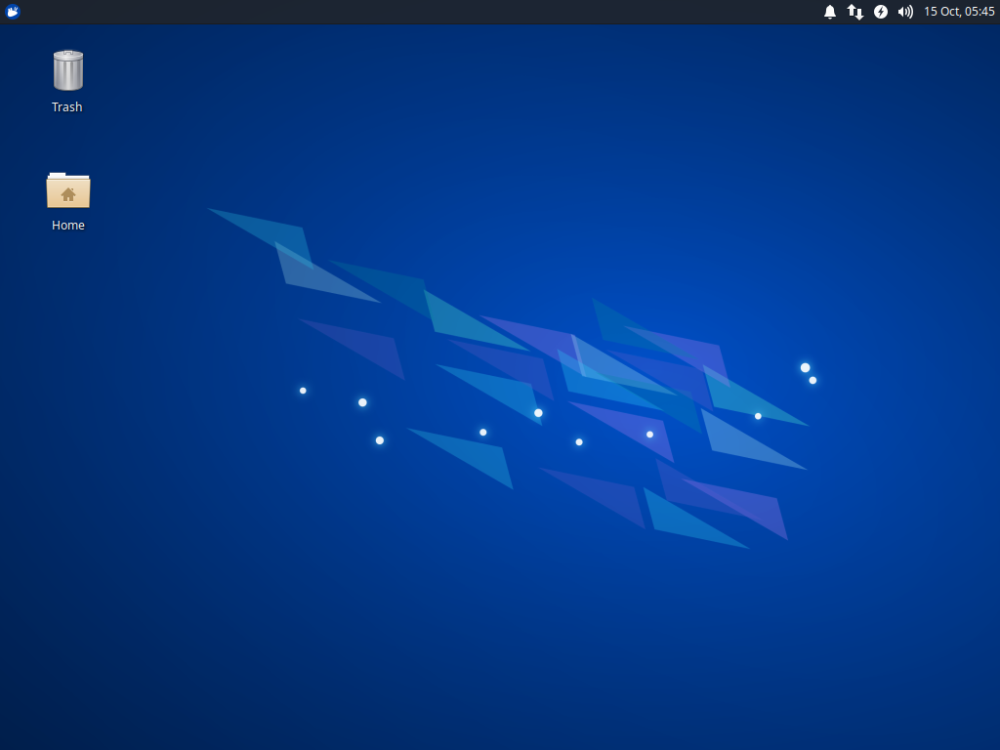
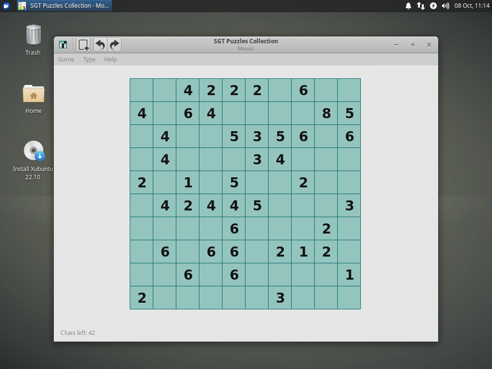

**Welcome to the Xubuntu 22.10 "Kinetic Kudu" release notes!**

Xubuntu 22.10 will be released on Thursday, October 20, 2022, and will be supported for nine months until July 2023. For general information and the latest updates for Xubuntu 22.10, check out the [release page](https://xubuntu.org/release/22-10) on xubuntu.org.

* [Known Issues](#known_issues)
* [Ubuntu Common Release Notes](#ubuntu_common_release_notes)
* [Major Updates](#major_updates)
* [Updates](#updates)
* [Changelogs](#changelogs)

## Known Issues

### Installer Issues

* grub-installer chooses which drive to install to with no user input ([964331](https://bugs.launchpad.net/ubuntu/+source/grub-installer/+bug/964331))
* OEM installation uses the wrong slideshow ([1842047](https://bugs.launchpad.net/ubuntu/+source/ubiquity-slideshow-ubuntu/+bug/1842047))
* No shutdown prompt after installation ([1944519](https://bugs.launchpad.net/ubuntu/+source/casper/+bug/1944519))
  * However, you should be able to press the Enter key to continue with the reboot.
* Xubuntu installer on desktop is "untrusted" ([1987958](https://bugs.launchpad.net/ubuntu/+source/ubiquity/+bug/1987958))
  * The launcher can be run from the menu or you can click "Launch anyway".

### General Issues

* Boot: Decryption password prompt not visible ([1917062](https://bugs.launchpad.net/xubuntu-artwork/+bug/1917062))
* Xfce Pulseaudio Plugin: Multiple notifications displayed if multiple Pulseaudio plugins added to panel ([1769775](https://bugs.launchpad.net/ubuntu/+source/xfce4-pulseaudio-plugin/+bug/1769775))
* Xfce Screensaver: Password required twice when switching users ([1874178](https://bugs.launchpad.net/ubuntu/+source/lightdm/+bug/1874178))

## Ubuntu Common Release Notes

The main Ubuntu [Release Notes](https://discourse.ubuntu.com/t/kinetic-kudu-release-notes/27976) covers both many of the other packages we carry and more issues common to every Ubuntu flavor.

### Pipewire

Unlike Ubuntu and the other flavors, Xubuntu *has not* switched to Pipewire in 22.10. If you want to use Pipewire, our good friends, Ubuntu MATE, have [provided instructions](https://ubuntu-mate.org/blog/ubuntu-mate-kinetic-kudu-release-notes/#pipewire-on-ubuntu-mate-2204) to switch to the new sound system.

''sudo apt-get install gstreamer1.0-pipewire pipewire-audio-client-libraries wireplumber'' \\
''sudo apt-get remove pulseaudio-module-bluetooth'' \\
''sudo apt-get install libfdk-aac2 libldacbt-abr2 libldacbt-enc2 libopenaptx0 libspa-0.2-bluetooth libspa-0.2-jack''

## Major Updates

* **Xfce 4.17**, the development version of the next major release, is included in Xubuntu 22.10. Notable app updates include:
  * **Catfish** has a refreshed appearance with tweaks to each component. It also features a new "Open with" context menu and the Ctrl+A select-all accelerator.
  * **Mousepad** has added search history and the ability to reload files if they've been modified automatically.
  * **Thunar** now has built-in, recursive file search. It also includes a graphical shortcuts editor and per-directory zoom levels.
  * **Thunar Archive Plugin** now allows zip files (including odt, docx, and others) to be compressed.
  * **Xfce Application Finder** now supports the *PrefersNonDefaultGPU* property, correctly launching games and other apps on multi-GPU systems.
  * **Xfce Desktop** will now ask for confirmation before desktop icons are rearranged. A new option has been added to disable the "Delete" context menu item.
  * **Xfce Notification Daemon** features improved application icon and name matching and fixes notification position during the slideout animation.
  * **Xfce Panel** has added a new binary time mode and new middle-click options for the tasklist plugin. It also improves the handling and display of systray and status notifier applets.
  * **Xfce PulseAudio Plugin** features a new indicator for when any app is recording audio. Notifications are now displayed when the microphone volume level is changed.
  * **Xfce Screenshooter** fixes window capture for HiDPI, enables viewing your screenshot in the file manager, and adds a back button to take a new screenshot.
  * **Xfce Task Manager** adds a right-click option to copy the full process command line to the clipboard.
  * **Xfce Terminal** improves scrolling, adds a new "Fill" background image style, and fixes the "unsafe paste" dialog (allowing it to actually paste).
* **Mosaic**, the grid-filling puzzle, has been added to SGT Puzzles. You can play the game online, [here](https://www.chiark.greenend.org.uk/~sgtatham/puzzles/js/mosaic.html).

## Appearance Updates

### Theme Updates

* **Greybird 3.23.2** adds support for Openbox and includes some minor visual improvements for Xfwm4 and GNOME Software.
* **elementary-xfce 0.17** adds many new icons and refreshes several others for a cleaner and more consistent Xubuntu desktop experience. It also deprecates the elementary-xfce-darker theme.

## Updates

//Significant package and version updates. For full package changelogs, see the [Changelogs](#Changelogs) section below.//

### Application Stack

* GNOME 43
* GTK 2.24.33 / 3.24.34 / 4.8.1
* MATE 1.26
* Xfce 4.17

### Subsystems

* BlueZ 5.65
* CUPS 2.4.2
* NetworkManager 1.40
* Mesa 22.2.0
* Poppler 22.08.0
* PulseAudio 16.1
* xdg-desktop-portal 1.15.0

### Themes

* elementary-xfce 0.17
* Greybird 3.23.2

### Applications

#### Xfce

* Catfish 4.16.4
* Exo 4.17.2
* Gigolo 0.5.2
* Mousepad 0.5.10
* Ristretto 0.12.3
* Thunar File Manager 4.17.9
* Xfce Application Finder 4.17.0
* Xfce Clipman Plugin 1.6.2
* Xfce Netload Plugin 1.4.0
* Xfce Panel 4.17.3
* Xfce PulseAudio Plugin 0.4.5
* Xfce Screenshooter 1.9.11
* Xfce Settings 4.16.2
* Xfce Systemload Plugin 1.3.1
* Xfce Task Manager 1.5.4
* Xfce Whisker Menu Plugin 2.7.1

#### MATE

* Atril 1.26.0
* Engrampa 1.26.0
* MATE Calculator 1.26.0

#### GNOME

* GNOME Disk Usage Analyzer 43.0
* GNOME Disk Utility 43.0
* GNOME Mines 40.1
* GNOME Software 43.0
* GNOME Sudoku 43.0
* Rhythmbox 3.4.6
* Simple Scan 42.5

#### Everything Else

* Blueman 2.3.2
* Firefox 105.0.1 (snap)
* GIMP 2.10.32
* LibreOffice 7.4.2
* Pipewire 0.3.58
* Snapd 2.57.4
* SGT Launcher 0.2.8
* Thunderbird 102.3.3

## Changelogs

### Xubuntu/Other Packages

* apturl ([changelog](https://launchpad.net/ubuntu/kinetic/+source/apturl/+changelog))
* atril ([changelog](https://launchpad.net/ubuntu/kinetic/+source/atril/+changelog))
* baobab ([changelog](https://launchpad.net/ubuntu/kinetic/+source/baobab/+changelog))
* blueman ([changelog](https://launchpad.net/ubuntu/kinetic/+source/blueman/+changelog))
* elementary-xfce ([changelog](https://launchpad.net/ubuntu/kinetic/+source/elementary-xfce/+changelog))
* engrampa ([changelog](https://launchpad.net/ubuntu/kinetic/+source/engrampa/+changelog))
* gimp ([changelog](https://launchpad.net/ubuntu/kinetic/+source/gimp/+changelog))
* gnome-disk-utility ([changelog](https://launchpad.net/ubuntu/kinetic/+source/gnome-disk-utility/+changelog))
* gtk2-engines-xfce ([changelog](https://launchpad.net/ubuntu/kinetic/+source/gtk2-engines-xfce/+changelog))
* hexchat ([changelog](https://launchpad.net/ubuntu/kinetic/+source/hexchat/+changelog))
* lightdm-gtk-greeter ([changelog](https://launchpad.net/ubuntu/kinetic/+source/lightdm-gtk-greeter/+changelog))
* lightdm-gtk-greeter-settings ([changelog](https://launchpad.net/ubuntu/kinetic/+source/lightdm-gtk-greeter-settings/+changelog))
* mate-calc ([changelog](https://launchpad.net/ubuntu/kinetic/+source/mate-calc/+changelog))
* menulibre ([changelog](https://launchpad.net/ubuntu/kinetic/+source/menulibre/+changelog))
* mugshot ([changelog](https://launchpad.net/ubuntu/kinetic/+source/mugshot/+changelog))
* pavucontrol ([changelog](https://launchpad.net/ubuntu/kinetic/+source/pavucontrol/+changelog))
* rhythmbox ([changelog](https://launchpad.net/ubuntu/kinetic/+source/rhythmbox/+changelog))
* pipewire ([changelog](https://launchpad.net/ubuntu/kinetic/+source/pipewire/+changelog))
* sgt-launcher ([changelog](https://launchpad.net/ubuntu/kinetic/+source/sgt-launcher/+changelog))
* shimmer-themes ([changelog](https://launchpad.net/ubuntu/kinetic/+source/shimmer-themes/+changelog))
* syncaptic ([changelog](https://launchpad.net/ubuntu/kinetic/+source/synaptic/+changelog))
* xcape ([changelog](https://launchpad.net/ubuntu/kinetic/+source/xcape/+changelog))
* xubuntu-artwork ([changelog](https://launchpad.net/ubuntu/kinetic/+source/xubuntu-artwork/+changelog))
* xubuntu-core ([changelog](https://launchpad.net/ubuntu/kinetic/+source/xubuntu-meta/+changelog))
* xubuntu-default-settings ([changelog](https://launchpad.net/ubuntu/kinetic/+source/xubuntu-default-settings/+changelog))
* xubuntu-desktop ([changelog](https://launchpad.net/ubuntu/kinetic/+source/xubuntu-meta/+changelog))
* xubuntu-docs ([changelog](https://launchpad.net/ubuntu/kinetic/+source/xubuntu-docs/+changelog))
* xubuntu-meta ([changelog](https://launchpad.net/ubuntu/kinetic/+source/xubuntu-meta/+changelog))
* xubuntu-wallpapers ([changelog](https://launchpad.net/ubuntu/kinetic/+source/xubuntu-artwork/+changelog))

### Xfce Core

* exo ([changelog](https://launchpad.net/ubuntu/kinetic/+source/exo/+changelog))
* libxfce4ui ([changelog](https://launchpad.net/ubuntu/kinetic/+source/libxfce4ui/+changelog))
* libxfce4util ([changelog](https://launchpad.net/ubuntu/kinetic/+source/libxfce4util/+changelog))
* thunar ([changelog](https://launchpad.net/ubuntu/kinetic/+source/thunar/+changelog))
* thunar-volman ([changelog](https://launchpad.net/ubuntu/kinetic/+source/thunar-volman/+changelog))
* tumbler ([changelog](https://launchpad.net/ubuntu/kinetic/+source/tumbler/+changelog))
* xfce4-appfinder ([changelog](https://launchpad.net/ubuntu/kinetic/+source/xfce4-appfinder/+changelog))
* xfce4-panel ([changelog](https://launchpad.net/ubuntu/kinetic/+source/xfce4-panel/+changelog))
* xfce4-panel-profiles  ([changelog](https://launchpad.net/ubuntu/kinetic/+source/xfce4-panel-profiles/+changelog))
* xfce4-power-manager ([changelog](https://launchpad.net/ubuntu/kinetic/+source/xfce4-power-manager/+changelog))
* xfce4-session ([changelog](https://launchpad.net/ubuntu/kinetic/+source/xfce4-session/+changelog))
* xfce4-settings ([changelog](https://launchpad.net/ubuntu/kinetic/+source/xfce4-settings/+changelog))
* xfconf ([changelog](https://launchpad.net/ubuntu/kinetic/+source/xfconf/+changelog))
* xfdesktop4 ([changelog](https://launchpad.net/ubuntu/kinetic/+source/xfdesktop4/+changelog))
* xfwm4 ([changelog](https://launchpad.net/ubuntu/kinetic/+source/xfwm4/+changelog))

### Xfce Applications

* catfish ([changelog](https://launchpad.net/ubuntu/kinetic/+source/catfish/+changelog))
* gigolo ([changelog](https://launchpad.net/ubuntu/kinetic/+source/gigolo/+changelog))
* mousepad ([changelog](https://launchpad.net/ubuntu/kinetic/+source/mousepad/+changelog))
* parole ([changelog](https://launchpad.net/ubuntu/kinetic/+source/parole/+changelog))
* ristretto ([changelog](https://launchpad.net/ubuntu/kinetic/+source/ristretto/+changelog))
* xfburn ([changelog](https://launchpad.net/ubuntu/kinetic/+source/xfburn/+changelog))
* xfce4-notifyd ([changelog](https://launchpad.net/ubuntu/kinetic/+source/xfce4-notifyd/+changelog))
* xfce4-screensaver ([changelog](https://launchpad.net/ubuntu/kinetic/+source/xfce4-screensaver/+changelog))
* xfce4-screenshooter ([changelog](https://launchpad.net/ubuntu/kinetic/+source/xfce4-screenshooter/+changelog))
* xfce4-taskmanager ([changelog](https://launchpad.net/ubuntu/kinetic/+source/xfce4-taskmanager/+changelog))
* xfce4-terminal ([changelog](https://launchpad.net/ubuntu/kinetic/+source/xfce4-terminal/+changelog))

### Xfce Panel Plugins

* xfce4-clipman-plugin ([changelog](https://launchpad.net/ubuntu/kinetic/+source/xfce4-clipman-plugin/+changelog))
* xfce4-cpugraph-plugin ([changelog](https://launchpad.net/ubuntu/kinetic/+source/xfce4-cpugraph-plugin/+changelog))
* xfce4-dict ([changelog](https://launchpad.net/ubuntu/kinetic/+source/xfce4-dict/+changelog))
* xfce4-indicator-plugin ([changelog](https://launchpad.net/ubuntu/kinetic/+source/xfce4-indicator-plugin/+changelog))
* xfce4-mailwatch-plugin ([changelog](https://launchpad.net/ubuntu/kinetic/+source/xfce4-mailwatch-plugin/+changelog))
* xfce4-netload-plugin ([changelog](https://launchpad.net/ubuntu/kinetic/+source/xfce4-netload-plugin/+changelog))
* xfce4-notes-plugin ([changelog](https://launchpad.net/ubuntu/kinetic/+source/xfce4-notes-plugin/+changelog)
* xfce4-places-plugin ([changelog](https://launchpad.net/ubuntu/kinetic/+source/xfce4-places-plugin/+changelog))
* xfce4-pulseaudio-plugin ([changelog](https://launchpad.net/ubuntu/kinetic/+source/xfce4-pulseaudio-plugin/+changelog))
* xfce4-quicklauncher-plugin ([changelog](https://launchpad.net/ubuntu/kinetic/+source/xfce4-quicklauncher-plugin/+changelog))
* xfce4-statusnotifier-plugin ([changelog](https://launchpad.net/ubuntu/kinetic/+source/xfce4-statusnotifier-plugin/+changelog))
* xfce4-systemload-plugin ([changelog](https://launchpad.net/ubuntu/kinetic/+source/xfce4-systemload-plugin/+changelog))
* xfce4-verve-plugin ([changelog](https://launchpad.net/ubuntu/kinetic/+source/xfce4-verve-plugin/+changelog))
* xfce4-weather-plugin ([changelog](https://launchpad.net/ubuntu/kinetic/+source/xfce4-weather-plugin/+changelog))
* xfce4-whiskermenu-plugin ([changelog](https://launchpad.net/ubuntu/kinetic/+source/xfce4-whiskermenu-plugin/+changelog))
* xfce4-xkb-plugin ([changelog](https://launchpad.net/ubuntu/kinetic/+source/xfce4-xkb-plugin/+changelog))

### Thunar Plugins

* thunar-archive-plugin ([changelog](https://launchpad.net/ubuntu/kinetic/+source/thunar-archive-plugin/+changelog))
* thunar-media-tags-plugin ([changelog](https://launchpad.net/ubuntu/kinetic/+source/thunar-media-tags-plugin/+changelog))
