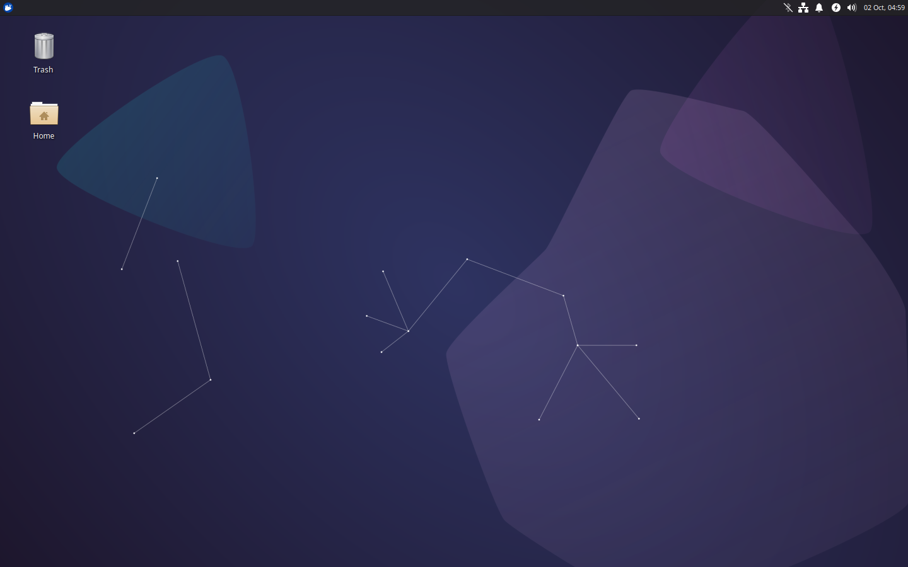

**Welcome to the Xubuntu 23.10 "Mantic Minotaur" release notes!**

Xubuntu 23.10 was released on Thursday, October 12, 2023, and will be supported for nine months until July 2024. For general information and the latest updates for Xubuntu 23.10, check out the [release page](https://xubuntu.org/release/23-10) on xubuntu.org.

* [Known Issues](#known-issues)
* [Ubuntu Common Release Notes](#ubuntu-common-release-notes)
* [Major Updates](#major-updates)
* [Appearance Updates](#appearance-updates)
* [Hardware Support](#hardware-support)
* [Updates](#updates)
* [Changelogs](#changelogs)

## Known Issues
### Installer Issues

* No shutdown prompt after installation ([1944519](https://launchpad.net/bugs/1944519))
  * However, you should be able to press the Enter key to continue with the reboot.
* Xubuntu installer on desktop is “untrusted” ([1987958](https://launchpad.net/bugs/1987958))
  * The launcher can be run from the menu or you can click “Launch anyway”.
* OEM installation fails on Xubuntu Minimal ([2013251](https://launchpad.net/bugs/2013251))
* Installer crashes when quitting in the live session ([2016009](https://launchpad.net/bugs/2016009))

### General Issues

* **Xfce Pulseaudio Plugin**
  * Multiple notifications displayed if multiple Pulseaudio plugins added to panel ([1769775](https://launchpad.net/bugs/1769775))
* **Virtual Machines**
  * Xorg crashes after logging in or switching users on some virtual machines, including QEMU/GNOME Boxes and Virtualbox ([1861609](https://launchpad.net/bugs/1861609))
  * Poor performance and audio stuttering in some virtual machines, including VMware and VirtualBox
    * In these instances, you will need to either adjust your configuration (recommended) or replace PipeWire with PulseAudio

### Ubuntu Common Release Notes

The main [Ubuntu Release Notes](https://discourse.ubuntu.com/t/mantic-minotaur-release-notes/35534) covers both many of the other packages we carry and more issues common to every Ubuntu flavor.

## Major Updates

* Xfce libraries, including **garcon**, **libxfce4ui**, **tumbler**, and **xfconf** have received several bug fixes for race conditions and memory leaks. Overall, the desktop should be more responsive and less prone to crash.
* **Mousepad 0.6.1** features better modification state tracking, UX improvements, and a new “match whole word” toggle added to the search toolbar.
* **Ristretto 0.13.1** adds printing support to Xubuntu's default image viewer.
* **Xfce Power Manager 4.18.2** and **Xfce Screensaver 4.18.2** received several updates to eliminate screensaver issues.
* **Xfce PulseAudio Plugin 0.4.7** received several bug fixes and updates to its media player and audio device handling. Media players can now be marked as persistent or ignored via the settings dialog.
* **Xfce Screenshooter 1.10.4** added support for AVIF and JPEG XL file formats.
* Numerous additional stable release updates for Xfce 4.18 and related applications.

## Appearance Updates

* **[elementary-xfce](https://github.com/shimmerproject/elementary-xfce/releases/tag/v0.18)** 0.18 features numerous refreshed icons across the entire Xubuntu desktop.
* **[Greybird 3.23.3](https://github.com/shimmerproject/Greybird/releases/tag/v3.23.3)** improves GTK 3 and 4 support.
* Some GNOME components, including **Disk Usage Analyzer** (baobab), **Fonts** (gnome-font-viewer), and **Document Scanner** (simple-scan) have a refreshed interface using libadwaita and newer design conventions.
* Several Xfce components have been updated to better support UI scaling. 2x scaling can be enabled from the Appearance dialog.
* **Color emoji** 😉️ are now included and used in Firefox, Thunderbird, and Gtk 3 and newer applications. To enter emoji on Gtk applications (such as Mousepad), use the `Ctrl + .` keyboard shortcut to show the emoji picker.
* When changing your Gtk (interface) theme, a matching Xfwm (window manager) theme is now automatically selected. This setting can be changed in the Appearance dialog.
* **[Past Xubuntu wallpapers](https://github.com/Xubuntu/xubuntu-marketing/blob/master/wallpapers/README.md)** can now be easily installed from the repositories! They're grouped by LTS release:
  * `xubuntu-wallpapers-jammy`: Hirsute, Impish, and Jammy
  * `xubuntu-wallpapers-focal`: Cosmic, Disco, Eoan, and Focal
  * `xubuntu-wallpapers-bionic`: Yakkety, Zesty, Artful, and Bionic
  * `xubuntu-wallpapers-xenial`: Utopic, Vivid, Wily, and Xenial
  * `xubuntu-wallpapers-trusty`: Quantal, Raring, Saucy, and Trusty
  * `xubuntu-wallpapers-precise`: Maverick, Natty, and Precise
  * `xubuntu-wallpapers-lucid`: Intrepid, Jaunty, Karmic, and Lucid
  * `xubuntu-wallpapers-hardy`: Edgy, Feisty, Gutsy, and Hardy
  * `xubuntu-wallpapers-dapper`: Dapper

## Hardware Support

* Bluetooth headphones are now better supported under PipeWire ([2017818](https://bugs.launchpad.net/ubuntu/+source/xubuntu-meta/+bug/2017818)) with the addition of `libspa-0.2-bluetooth`
* Recent touch input devices, including the second-generation Apple Magic Trackpad, are now supported with the removal of `xserver-xorg-input-synaptics`

## Updates

_Significant package and version updates. For full package changelogs, see the [Changelogs](#changelogs) section below._

### Application Stack

* GNOME 45
* GTK 2.24.33 / 3.24.38 / 4.12.1
* MATE 1.26
* Xfce 4.18

### Subsystems

* BlueZ 5.68
* CUPS 2.4.6
* Mesa 23.1.7
* Poppler 23.08.0
* PulseAudio 16.1
* xdg-desktop-portal 1.17.2

### Themes

* elementary-xfce 0.18
* Greybird 3.23.3

### Applications

#### Xfce

* Catfish 4.16.4
* Exo 4.18.0
* Gigolo 0.5.2
* Mousepad 0.6.1
* Ristretto 0.13.1
* Thunar File Manager 4.18.7
* Xfce Application Finder 4.18.0
* Xfce Clipman Plugin 1.6.4
* Xfce Netload Plugin 1.4.1
* Xfce Panel 4.18.4
* Xfce PulseAudio Plugin 0.4.7
* Xfce Screenshooter 1.10.4
* Xfce Settings 4.18.2
* Xfce Systemload Plugin 1.3.2
* Xfce Task Manager 1.5.5
* Xfce Whisker Menu Plugin 2.8.0

#### MATE

* Atril 1.26.0
* Engrampa 1.26.0
* MATE Calculator 1.26.0

#### GNOME

* GNOME Disk Usage Analyzer 45 alpha
* GNOME Disk Utility 45.0
* GNOME Mines 40.1
* GNOME Software 45 rc
* GNOME Sudoku 44.0
* Rhythmbox 3.4.7
* Simple Scan 44.0

#### Everything Else

* Blueman 2.3.5
* Firefox 117.0.1 (snap)
* GIMP 2.10.34
* LibreOffice 7.6.1.2
* Pipewire 0.3.79
* Snapd 2.60.3
* SGT Launcher 0.2.8
* Thunderbird 115.2.0

## Changelogs

### Xubuntu/Other Packages

* apturl [changelog](https://launchpad.net/ubuntu/mantic/+source/apturl/+changelog)
* atril [changelog](https://launchpad.net/ubuntu/mantic/+source/atril/+changelog)
* baobab [changelog](https://launchpad.net/ubuntu/mantic/+source/baobab/+changelog)
* blueman [changelog](https://launchpad.net/ubuntu/mantic/+source/blueman/+changelog)
* elementary-xfce [changelog](https://launchpad.net/ubuntu/mantic/+source/elementary-xfce/+changelog)
* engrampa [changelog](https://launchpad.net/ubuntu/mantic/+source/engrampa/+changelog)
* gimp [changelog](https://launchpad.net/ubuntu/mantic/+source/gimp/+changelog)
* gnome-disk-utility [changelog](https://launchpad.net/ubuntu/mantic/+source/gnome-disk-utility/+changelog)
* gtk2-engines-xfce [changelog](https://launchpad.net/ubuntu/mantic/+source/gtk2-engines-xfce/+changelog)
* hexchat [changelog](https://launchpad.net/ubuntu/mantic/+source/hexchat/+changelog)
* lightdm-gtk-greeter [changelog](https://launchpad.net/ubuntu/mantic/+source/lightdm-gtk-greeter/+changelog)
* lightdm-gtk-greeter-settings [changelog](https://launchpad.net/ubuntu/mantic/+source/lightdm-gtk-greeter-settings/+changelog)
* mate-calc [changelog](https://launchpad.net/ubuntu/mantic/+source/mate-calc/+changelog)
* menulibre [changelog](https://launchpad.net/ubuntu/mantic/+source/menulibre/+changelog)
* mugshot [changelog](https://launchpad.net/ubuntu/mantic/+source/mugshot/+changelog)
* pavucontrol [changelog](https://launchpad.net/ubuntu/mantic/+source/pavucontrol/+changelog)
* rhythmbox [changelog](https://launchpad.net/ubuntu/mantic/+source/rhythmbox/+changelog)
* pipewire [changelog](https://launchpad.net/ubuntu/mantic/+source/pipewire/+changelog)
* sgt-launcher [changelog](https://launchpad.net/ubuntu/mantic/+source/sgt-launcher/+changelog)
* shimmer-themes [changelog](https://launchpad.net/ubuntu/mantic/+source/shimmer-themes/+changelog)
* synaptic [changelog](https://launchpad.net/ubuntu/mantic/+source/synaptic/+changelog)
* xcape [changelog](https://launchpad.net/ubuntu/mantic/+source/xcape/+changelog)
* xubuntu-artwork [changelog](https://launchpad.net/ubuntu/mantic/+source/xubuntu-artwork/+changelog)
* xubuntu-core [changelog](https://launchpad.net/ubuntu/mantic/+source/xubuntu-meta/+changelog)
* xubuntu-default-settings [changelog](https://launchpad.net/ubuntu/mantic/+source/xubuntu-default-settings/+changelog)
* xubuntu-desktop [changelog](https://launchpad.net/ubuntu/mantic/+source/xubuntu-meta/+changelog)
* xubuntu-docs [changelog](https://launchpad.net/ubuntu/mantic/+source/xubuntu-docs/+changelog)
* xubuntu-meta [changelog](https://launchpad.net/ubuntu/mantic/+source/xubuntu-meta/+changelog)
* xubuntu-wallpapers [changelog](https://launchpad.net/ubuntu/mantic/+source/xubuntu-artwork/+changelog)

### Xfce Core

* exo [changelog](https://launchpad.net/ubuntu/mantic/+source/exo/+changelog)
* libxfce4ui [changelog](https://launchpad.net/ubuntu/mantic/+source/libxfce4ui/+changelog)
* libxfce4util [changelog](https://launchpad.net/ubuntu/mantic/+source/libxfce4util/+changelog)
* thunar [changelog](https://launchpad.net/ubuntu/mantic/+source/thunar/+changelog)
* thunar-volman [changelog](https://launchpad.net/ubuntu/mantic/+source/thunar-volman/+changelog)
* tumbler [changelog](https://launchpad.net/ubuntu/mantic/+source/tumbler/+changelog)
* xfce4-appfinder [changelog](https://launchpad.net/ubuntu/mantic/+source/xfce4-appfinder/+changelog)
* xfce4-panel [changelog](https://launchpad.net/ubuntu/mantic/+source/xfce4-panel/+changelog)
* xfce4-panel-profiles  [changelog](https://launchpad.net/ubuntu/mantic/+source/xfce4-panel-profiles/+changelog)
* xfce4-power-manager [changelog](https://launchpad.net/ubuntu/mantic/+source/xfce4-power-manager/+changelog)
* xfce4-session [changelog](https://launchpad.net/ubuntu/mantic/+source/xfce4-session/+changelog)
* xfce4-settings [changelog](https://launchpad.net/ubuntu/mantic/+source/xfce4-settings/+changelog)
* xfconf [changelog](https://launchpad.net/ubuntu/mantic/+source/xfconf/+changelog)
* xfdesktop4 [changelog](https://launchpad.net/ubuntu/mantic/+source/xfdesktop4/+changelog)
* xfwm4 [changelog](https://launchpad.net/ubuntu/mantic/+source/xfwm4/+changelog)

### Xfce Applications

* catfish [changelog](https://launchpad.net/ubuntu/mantic/+source/catfish/+changelog)
* gigolo [changelog](https://launchpad.net/ubuntu/mantic/+source/gigolo/+changelog)
* mousepad [changelog](https://launchpad.net/ubuntu/mantic/+source/mousepad/+changelog)
* parole [changelog](https://launchpad.net/ubuntu/mantic/+source/parole/+changelog)
* ristretto [changelog](https://launchpad.net/ubuntu/mantic/+source/ristretto/+changelog)
* xfburn [changelog](https://launchpad.net/ubuntu/mantic/+source/xfburn/+changelog)
* xfce4-notifyd [changelog](https://launchpad.net/ubuntu/mantic/+source/xfce4-notifyd/+changelog)
* xfce4-screensaver [changelog](https://launchpad.net/ubuntu/mantic/+source/xfce4-screensaver/+changelog)
* xfce4-screenshooter [changelog](https://launchpad.net/ubuntu/mantic/+source/xfce4-screenshooter/+changelog)
* xfce4-taskmanager [changelog](https://launchpad.net/ubuntu/mantic/+source/xfce4-taskmanager/+changelog)
* xfce4-terminal [changelog](https://launchpad.net/ubuntu/mantic/+source/xfce4-terminal/+changelog)

### Xfce Panel Plugins

* xfce4-clipman-plugin [changelog](https://launchpad.net/ubuntu/mantic/+source/xfce4-clipman-plugin/+changelog)
* xfce4-cpugraph-plugin [changelog](https://launchpad.net/ubuntu/mantic/+source/xfce4-cpugraph-plugin/+changelog)
* xfce4-dict [changelog](https://launchpad.net/ubuntu/mantic/+source/xfce4-dict/+changelog)
* xfce4-indicator-plugin [changelog](https://launchpad.net/ubuntu/mantic/+source/xfce4-indicator-plugin/+changelog)
* xfce4-mailwatch-plugin [changelog](https://launchpad.net/ubuntu/mantic/+source/xfce4-mailwatch-plugin/+changelog)
* xfce4-netload-plugin [changelog](https://launchpad.net/ubuntu/mantic/+source/xfce4-netload-plugin/+changelog)
* xfce4-notes-plugin [changelog](https://launchpad.net/ubuntu/mantic/+source/xfce4-notes-plugin/+changelog)
* xfce4-places-plugin [changelog](https://launchpad.net/ubuntu/mantic/+source/xfce4-places-plugin/+changelog)
* xfce4-pulseaudio-plugin [changelog](https://launchpad.net/ubuntu/mantic/+source/xfce4-pulseaudio-plugin/+changelog)
* xfce4-quicklauncher-plugin [changelog](https://launchpad.net/ubuntu/mantic/+source/xfce4-quicklauncher-plugin/+changelog)
* xfce4-statusnotifier-plugin [changelog](https://launchpad.net/ubuntu/mantic/+source/xfce4-statusnotifier-plugin/+changelog)
* xfce4-systemload-plugin [changelog](https://launchpad.net/ubuntu/mantic/+source/xfce4-systemload-plugin/+changelog)
* xfce4-verve-plugin [changelog](https://launchpad.net/ubuntu/mantic/+source/xfce4-verve-plugin/+changelog)
* xfce4-weather-plugin [changelog](https://launchpad.net/ubuntu/mantic/+source/xfce4-weather-plugin/+changelog)
* xfce4-whiskermenu-plugin [changelog](https://launchpad.net/ubuntu/mantic/+source/xfce4-whiskermenu-plugin/+changelog)
* xfce4-xkb-plugin [changelog](https://launchpad.net/ubuntu/mantic/+source/xfce4-xkb-plugin/+changelog)

### Thunar Plugins

* thunar-archive-plugin [changelog](https://launchpad.net/ubuntu/mantic/+source/thunar-archive-plugin/+changelog)
* thunar-media-tags-plugin [changelog](https://launchpad.net/ubuntu/mantic/+source/thunar-media-tags-plugin/+changelog)
